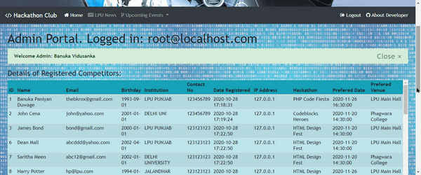
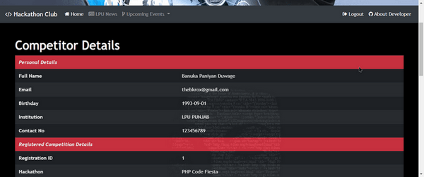
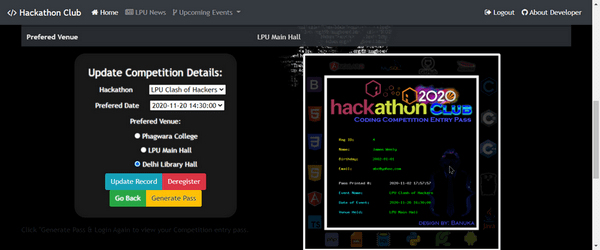

# Hackathon
Hackathon Club Registration - PHP Project

[

(Below are concepts implemented in the program, highlighted in code for easier discovery.)
Database management – CRUD Application development
Have implemented many of the basic SQL queries such as:
•	CREATE TABLE tbname;
•	DROP TABLE tbname;
•	INSERT INTO tbname (……) VALUES (…..);
•	SELECT * FROM tbname;
•	SELECT * FROM tbname WHERE email = ‘myemail’;
•	DELETE FROM tbname WHERE email = ‘myemail’;
•	UPDATE tbname SET (………….) WHERE email = ‘myemail’;

## Have used String handling functions below to achieve (in formhandle.php):
•	Trim() – trim starting & leading white spaces in all user input
•	Strtolower() – convert email to lowercase
•	Strtoupper() - convert institution name to uppercase
•	Ucwords() – capitalize 1st letter of each word
•	preg_replace() – to sanitize user name & remove any non-alphabet characters
•	strcasecmp() – used to validate user email & password
•	strlen() – used to get string length to apply constraint validation on user input (password len)
•	substr() – used to extract year of birth from date of birth entered by user
•	intval() – used to convert birth year to int & then calculate user age to determine age >16

## Have used array handling functions below to achieve (in index.php):
•	array_push() – create new array and push data in to it
•	explode() – break string in to an array by breaking at specified needle (get email domain)
•	array_count_values() – create an associative array by counting occurrences of elements in an array
•	assort(), ksort(), arsort() – sorting functions are used to sort associative array data to fit the needs
•	foreach() – used to access array elements and display to user in tabular form

## Additional Concepts Used (out of syllabus):
$ip = getenv("REMOTE_ADDR");  - used to get ip-address of user registering account in application
Htmlentities() – function converts characters to HTML entities. Display clean data output.
Mysqli Prepared statements are used to avoid SQL-injection in the program.
Bootstrap 4 classes, font-awesome & css properties used for styling the application
require_once – statement is used to import a file with php code that is reused across the application
header() – function for redirecting to pages
Image-Create functionality of PHP is used to generate a “contestant entry pass” based on user data.
JavaScript functionality used for sticky navbar & alert() function

### Admin Portal
[

### User Portal
[
[
